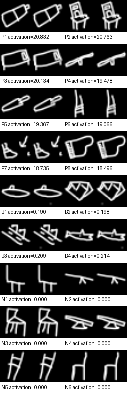

# Feature Genesis

A deterministic causal microscope for studying how learned features are created during neural network training.

The current v4 DGX experiment trains a grayscale QuickDraw ResNet-34 with GroupNorm from scratch, extracts activations at exact checkpoints, learns sparse feature dictionaries, aligns feature identities through time, and tests which individual training drawings changed a selected feature by replaying the original optimization trajectory.

The central object is not merely a final SAE latent. It is a feature genealogy:

\[
\text{precursor} \rightarrow \text{specialization} \rightarrow \text{stable feature} \rightarrow \text{split, merge, or death}.
\]

## What is implemented

- Scratch training of a GroupNorm QuickDraw ResNet-34 on 4.5 million local drawings across 345 classes.
- A retired CUB-200-2011 experiment retained only as a documented visual-semantic failure case.
- A compact synthetic shapes benchmark with known generative factors.
- Persisted batch plans and sample-epoch keyed augmentations.
- Exact optimizer, model, RNG, data-plan, dataset, configuration, and environment replay checks.
- Fixed-denominator example removal for clean counterfactual training interventions.
- BatchTopK, cosine-scored BatchTopK, JumpReLU, Matryoshka, TopK, and Matching Pursuit SAEs.
- SAE comparison at matched realized sparsity, reconstruction, and downstream model fidelity.
- Continual SAE trajectories, independent final-checkpoint SAE baselines, orthogonal Procrustes alignment, and reliability-gated final-feature backward projection.
- Checkpoint-local SAE normalization, image-disjoint train/selection/calibration/evaluation partitions, calibrated final checkpoints, multi-seed artifacts, and a mandatory scientific validation gate.
- Continue, birth, death, split, and merge lineage events.
- Activation-spectrum sampling, class-confounding gates, spatial connected-component localization, ablation, steering, and model substitution tests.
- Batch gradient-alignment screening, per-example directional influence estimates, and exact deterministic single-step causal replay.
- Individually rendered boxed and zoomed evidence images and Gemini 3.6 multimodal evaluation with independent visual and quantitative analysts, structured adjudication, target-free held-out validation, causal evidence, prompt/model provenance, and resumable request caching.
- A machine-readable end-to-end artifact validator that checks replay, SAE fidelity, Gemini validation, lineage continuity, causal signs, interventions, and reporting.

## Why QuickDraw

The DGX corpus at `/mnt/hdd/QuickDraw` contains 4,500,000 training drawings plus 250,000 validation and 250,000 test drawings. Simple repeated strokes, corners, loops, junctions, contours, and object parts make the visual semantics easier to falsify than fine-grained bird photographs. The larger evidence pool also supports activation-spectrum sampling and cross-class validation without recycling the SAE-training examples.

The CUB run passed its mathematical gates but failed the visual gate. Its response plots used raw positive preactivations instead of the actual thresholded sparse code and normalized every image independently. Candidate selection also rewarded species-correlated CUB attributes. Those defects and their replacements are documented in `docs/V3_QUICKDRAW.md`.

## Current configuration

The primary experiment is defined in `configs/quickdraw_dgx_v4.yaml`:

- Model: scratch QuickDraw ResNet-34 with GroupNorm.
- Input: deterministic 64 × 64 grayscale drawings with small affine augmentation.
- Task: 345-way drawing classification.
- Hook: `layer2`.
- Training: five epochs, 21,975 SGD steps, batch size 1,024, bfloat16, and channels-last tensors.
- Checkpoints: 18 developmental snapshots from initialization through convergence.
- Primary SAE: 512-feature cosine TopK dictionary with exact L0 of 8 and three seeds.
- Semantic cache: a held-out validation subset with every spatial location preserved.
- Main causal unit: an exact replay interval beginning at a persisted optimizer anchor.

GroupNorm is intentional. BatchNorm makes one sample affect every other sample through batch statistics. GroupNorm removes that cross-sample path, so masking one example's loss is a much cleaner intervention.

## Saved QuickDraw v4 evidence

The local artifact tree contains a completed single-model run, `quickdraw_resnet34_gn_seed1729_v4`, at 21,975 optimizer steps. Its held-out validation and test splits each contain 250,000 drawings:

| Measurement | Saved result |
|---|---:|
| Validation accuracy | 78.32% |
| Validation balanced accuracy | 78.26% |
| Test accuracy | 78.24% |
| Test balanced accuracy | 78.14% |
| Test top-5 accuracy | 93.67% |

These are classifier metrics for the QuickDraw task; they do not measure feature interpretability or causal attribution. The run's summary reports 14 features accepted by its scientific gate and 141 rejected or retained as controls. The three manually adjudicated example labels are provisional: feature 89 is a solid terminal bulb attached to a stroke, feature 99 is a small enclosed loop attached to a stroke frame, and feature 164 is a solid filled region attached to a line structure.

The saved artifact validator passed its recorded checks for the SAE gate, held-out feature review, interventions, causal replay consistency, reports, and exact supervised replay. That replay from step 19,778 through step 21,975 was bitwise identical. Separately, `proof/` records 24 passing tests and a deterministic toy smoke run; the toy proof is pipeline evidence, not a scientific result.

The later Circuit Genesis pilot gate also passed for features 89, 99, and 164. Its saved pilot graphs contain 65–66 nodes and 147–197 screened edges each, with all screened edge signs confirmed in the pilot. This is an early pilot, not a completed multi-seed circuit genealogy or a general claim about how neural features develop.



The image is one reviewed example from the single QuickDraw run. Its label remains provisional and the contact sheet is qualitative evidence, not proof of a canonical feature meaning.

The full checkpoints, caches, generated evidence, and per-feature dossiers live under `runs/` and are deliberately excluded from the public source repository. The small image above is retained to show the kind of evidence the pipeline inspects. The current evidence is limited to one QuickDraw model run and this dataset's drawing style; replication across model seeds, architectures, and domains remains necessary.

## Immediate verification

```bash
source ~/ai/envs/dgx-dl/bin/activate
python -m compileall -q src scripts
python scripts/20_validate_experiment_artifacts.py
```

The validator fails loudly if any final scientific claim disagrees with its source artifacts. A passing result is written to `runs/quickdraw_resnet34_gn_seed1729_v4/artifact_validation.json`.

## Main experiment

The QuickDraw pipeline is compute- and storage-intensive: it trains over 4.5 million drawings, writes large checkpoints and activation caches under ignored local run directories, and has explicit stage gates. Use the existing DGX environment documented in the project instructions; do not reinstall or replace its shared PyTorch stack. The commands below describe the staged research workflow; they do not need to be rerun to inspect this repository.

All scripts use editable constants at the top rather than command-line arguments.

```bash
python scripts/00_validate_quickdraw.py
python scripts/01_train_model.py
python scripts/01_validate_classifier.py
python scripts/02_verify_replay.py
python scripts/03_cache_activations.py
python scripts/04_train_saes.py
python scripts/04_validate_saes.py
python scripts/11_evaluate_sae_fidelity.py
python scripts/05_compute_signatures.py
python scripts/06_build_lineage.py
python scripts/07_score_concepts.py
python scripts/14_export_feature_cards.py
```

Inspect the exported cards before spending Gemini tokens. Then run semantic evaluation, lineage projection, and the selected-feature causal pilot:

```bash
python scripts/15_evaluate_features_gemini.py
python scripts/16_import_feature_labels.py
python scripts/13_backward_feature_trajectories.py
python scripts/08_rank_training_batches.py
python scripts/17_render_training_influence.py
python scripts/09_counterfactual_replay.py
python scripts/18_summarize_causal_validation.py
python scripts/12_evaluate_intervention.py
python scripts/19_build_experiment_summary.py
python scripts/21_generate_feature_dossiers.py
python scripts/10_make_report.py
python scripts/20_validate_experiment_artifacts.py
```

`04_train_saes.py` writes v6 TopK artifacts under an immutable `artifact_version / role / seed` hierarchy. It trains three continual seeds and three independent final-checkpoint controls. Downstream stages refuse to run until `04_validate_saes.py` passes calibration, normalization, reconstruction, sparsity, liveness, state-hash, and cross-seed checks.

`15_evaluate_features_gemini.py` reads `GEMINI_API_KEY` from `.env` and uses `gemini-3.6-flash` with medium thinking. Every drawing is a separate image input. Positive evidence is shown as a labeled original/box/zoom triptych. The validator receives 12 unseen top-tail positives and 12 matched zero-activation controls in a blinded order. A visual analyst and quantitative analyst work independently; an adjudicator produces visual primitives, triggers, non-triggers, spectrum behavior, and confounding assessment. A bounded one-request collision pass distinguishes near-duplicate labels. API responses are cached individually.

Gradient influence is only a candidate ranking. `09_counterfactual_replay.py` masks examples at exactly the selected training step and replays to the structurally traceable birth node. Builder or breaker wording is assigned only afterward by `18_summarize_causal_validation.py` from the sign of the causal presence effect.

`21_generate_feature_dossiers.py` creates a searchable 512-slot atlas and one genesis/evolution report for every explorable candidate under `reports/features`. Validated features receive the full semantic, visual, causal, and intervention dossier. Unlabeled candidates receive quantitative quality, strongest-edge ancestry, and reliability-gated evolution without inventing a human label. It reads cached artifacts only and makes no Gemini requests.

## What each stage means

| Stage | Output | Evidential status |
|---|---|---|
| Base training | Exact model anchors | Optimization trajectory |
| Activation caching | Corresponding rows across checkpoints | Observational representation data |
| SAE training | Sparse candidate features | Measurement model, not ground truth |
| SAE validation gate | Calibration, liveness, held-out reconstruction, cross-seed stability | Required precondition for downstream analysis |
| Feature signatures | Decoder, activation, concept, frequency profiles | Multi-view identity evidence |
| Lineage matching | Continue, split, merge, birth, death proposals | Hypotheses requiring validation |
| Gradient ranking | Candidate influential batches | First-order local screening |
| Counterfactual replay | Feature change after a controlled retrain | Causal evidence within the replay interval |
| Input perturbation | Response to part or factor edits | Semantic and spatial validation |
| Gemini feature evaluation | Contrastive hypothesis, counterevidence, falsifiers, blinded held-out score | Versioned semantic hypothesis, never ground truth |

## Deterministic replay scope

The project enforces deterministic algorithms, disables TF32, disables cuDNN benchmarking, saves exact batch plans, keys augmentation by sample and epoch, and stores model, optimizer, and RNG state at each anchor.

Before replay, it verifies:

- Training configuration hash.
- Dataset signature hash.
- Batch-plan hash.
- Python, PyTorch, torchvision, NumPy, Pillow, platform, machine, CUDA, cuDNN, and GPU identity.
- Anchor metadata consistency.

Bitwise equality is promised only under the same critical software and hardware environment. PyTorch itself does not guarantee identical results across releases, platforms, or different hardware.

## Repository layout

```text
configs/                  Main and smoke configurations
docs/                     Research design and mathematical protocol
proof/                    Executed tests, hashes, environment, and smoke outputs
scripts/                  Directly runnable experiment stages
src/feature_genesis/      Library code
tests/                    Proof-oriented unit and integration tests
```

## Scientific position

An SAE feature is not assumed to be a canonical unit of the underlying network. The project therefore triangulates feature existence with several independent measurements and reports disagreement rather than hiding it.

The strongest publishable claim is not that a latent has a good natural-language label. It is that a feature trajectory survives independent measurement, responds selectively to controlled semantic edits, affects model behavior when intervened on, and changes predictably when specific training evidence is removed or replaced under exact replay.

## Documentation

- `IDEA.md`: research thesis and intended contribution.
- `docs/METHOD.md`: full method.
- `docs/MATHEMATICS.md`: equations and proof obligations.
- `docs/REPRODUCIBILITY.md`: deterministic contract.
- `docs/EXPERIMENTS.md`: paper-grade experiment matrix.
- `docs/FAILURE_MODES.md`: threats to validity.
- `docs/COMPUTE_BUDGET.md`: storage and compute planning.
- `docs/PAPER_OUTLINE.md`: suggested paper structure.
- `docs/REFERENCES.md`: primary references.

## License and data

No `LICENSE` or `NOTICE.md` file is present, so the repository's code licensing status is unspecified. QuickDraw, CUB, and their annotations are not bundled; obtain each dataset separately and follow its original terms. The ignored local `data/` and `runs/` directories may contain large source data or derived research artifacts and are not part of the public source upload.
